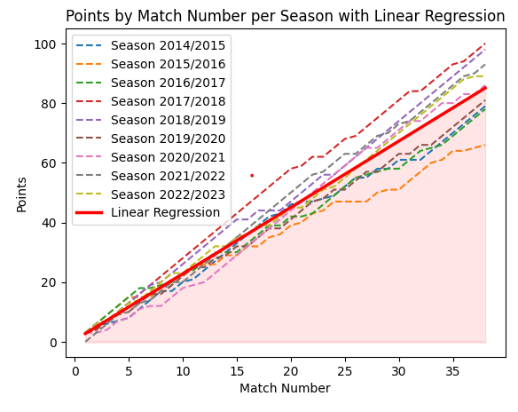
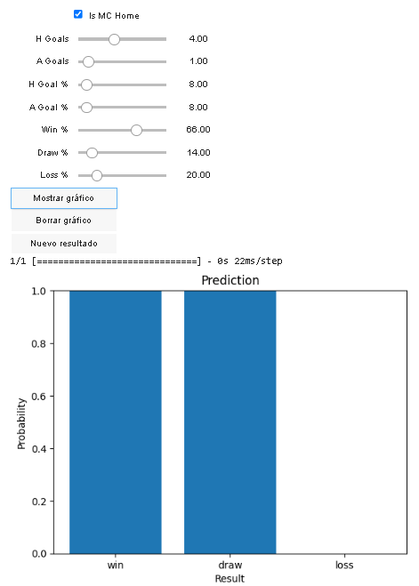
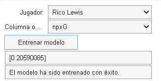

# SoccerPredict and Scrapping

## Tabla de Contenidos
- [Descripción](#descripción)
- [Funciones para recopilar datos de equipos](#funciones-para-recopilar-datos-de-equipos)
- [Uso](#uso)
- [Resultados](#resultados-análisis-del-manchester-city)
- [Modelos usados](#modelos-utilizados-para-las-predicciones)
- [Archivos generados](#archivos-generados)
- [Contribución](#contribución)
- [Licencia](#licencia)

## Descripción
Este proyecto contiene scripts robustos de Python que utilizan técnicas de web scraping para recopilar datos detallados de partidos de fútbol de diversas fuentes en la web. Con un enfoque en ligas y torneos internacionales importantes, los datos recopilados abarcan varias categorías, incluyendo estadísticas de jugadores, rendimiento de equipos, resultados históricos y mucho más.

## Funciones para recopilar datos de equipos

El archivo `TeamScraper.py` contiene una clase `TeamScraper` que proporciona funciones para realizar web scraping y obtener datos de equipos. A continuación se muestra un ejemplo de cómo utilizar estas funciones:

```python
year_seasons = [2014, 2015, 2016, 2017, 2018, 2019, 2020, 2021, 2022]
team = input('Enter the team name:')

season_dfs = []
player_dfs = []
matches_dfs = []

for year_season in year_seasons:
    team_scraper = TeamScraper(team, year_season)

    team_data = team_scraper.scrape_team_data()
    season_dfs.append(team_data)

    team_players, team_name = team_scraper.scrape_team_players()
    player_dfs.append(team_players)

    filename = f"{team}_{year_season}.csv"
    match_data, data_names = team_scraper.read_match_data(filename)

    df_matches = team_scraper.convert_to_dataframe(data_names)
    df_matches['season'] = f"{str(year_season)}/{str(year_season + 1)}"

    matches_dfs.append(df_matches)

all_matches_df = pd.concat(matches_dfs)
all_matches_df.to_csv('MC_matches.csv', index=False)
df_compiled = pd.concat(season_dfs)
df_compiled.to_csv('MC_seasons.csv', index=False)
df_compiled_players = pd.concat(player_dfs)
df_compiled_players.to_csv('MC_players.csv', index=False)
```
## Ligas Disponibles

A continuación se muestra una lista de las ligas disponibles actualmente en el proyecto:


                                 

Puedes seleccionar una liga específica para recopilar datos utilizando el script correspondiente.

## Uso

1. **Configuración inicial:**
   - Asegúrate de tener Python instalado en tu sistema.
   - Descarga el proyecto SoccerPredict y Scrapping desde el repositorio de GitHub.

2. **Preparación de datos:**
   - Abre el archivo principal del script en tu entorno de desarrollo (por ejemplo, Jupyter Notebook, PyCharm, etc.).
   - Asegúrate de tener instaladas las bibliotecas necesarias, como `requests`, `beautifulsoup4`, `pandas`, `ipywidgets` y `IPython`.
   - Importa las bibliotecas y las clases/funciones necesarias definidas en el script principal.

3. **Configuración de parámetros:**
   - Define la lista `year_seasons` con los años de las temporadas deseadas de las que quieres obtener datos.
   - Ingresa el nombre del equipo que deseas analizar cuando se te solicite.

4. **Ejecución del script:**
   - Ejecuta el script para iniciar el proceso de recopilación de datos.
   - El script realizará web scraping desde varias fuentes para obtener estadísticas detalladas del equipo especificado en cada temporada.
   - Los datos recopilados se guardarán en archivos CSV correspondientes a cada temporada y tipo de datos (partidos, jugadores, etc.).

5. **Análisis y uso de los datos:**
   - Una vez que se haya completado la ejecución del script, puedes utilizar los archivos CSV generados para análisis, visualizaciones u otras tareas relacionadas con los datos de fútbol recopilados.
   - Puedes cargar los archivos CSV en herramientas como Excel, pandas u otras bibliotecas de manipulación de datos para explorar y trabajar con los datos recopilados.
  

5. **Clona el repositorio a tu máquina local:**
   ```shell
   git clone https://github.com/Kevinsky29/SoccerPredict_and_Scrapp

Ten en cuenta que el script proporcionado es un punto de partida para recopilar datos de equipos de fútbol y puedes personalizarlo según tus necesidades específicas.

## Resultados: Análisis del Manchester City

### Predicciones de Temporadas

A continuación se presenta un gráfico que muestra los puntos obtenidos por el Manchester City en cada temporada:



### Predicciones de Partidos

Para realizar predicciones de los resultados de los partidos del Manchester City, se ha entrenado un modelo utilizando técnicas de aprendizaje automático. A continuación se muestra un gráfico que representa la probabilidad de obtener cada resultado (victoria, empate, derrota) en un partido:



### Predicción de Rendimiento de Jugadores

También se ha desarrollado un modelo para predecir el rendimiento de los jugadores del Manchester City. Puedes seleccionar un jugador y una columna objetivo para obtener una predicción del valor correspondiente:



### Modelos Utilizados para las Predicciones

Se utilizaron los siguientes modelos para realizar las predicciones en el proyecto:

- **Predicciones de Temporadas:** Se utilizó un modelo de regresión lineal para predecir los puntos obtenidos por el Manchester City en cada temporada. El modelo fue entrenado utilizando los datos históricos de las temporadas anteriores.

- **Predicciones de Partidos:** Se utilizó un modelo de redes neuronales artificiales (RNA) para predecir los resultados de los partidos del Manchester City. El modelo fue entrenado utilizando características como si el Manchester City jugaba en casa o como visitante, la cantidad de goles marcados por el equipo y el porcentaje de goles marcados tanto por el equipo como por el oponente.

- **Predicción de Rendimiento de Jugadores:** Se utilizó un modelo de regresión lineal para predecir el rendimiento de los jugadores del Manchester City. El modelo fue entrenado utilizando características específicas de cada jugador, como goles marcados, asistencias y minutos jugados, entre otros.

Estos modelos se utilizaron para realizar las predicciones correspondientes y proporcionar información adicional sobre el desempeño del Manchester City en las temporadas y los partidos, así como el rendimiento de los jugadores.

## Archivos Generados

Durante la ejecución del proyecto, se generarán algunos archivos que contienen los datos y resultados obtenidos. Estos archivos se encuentran en la carpeta "examples" del repositorio. A continuación se muestra una lista de los archivos generados:

- `MC_matches.csv`: Archivo que contiene los datos de los partidos del Manchester City.
- `MC_seasons.csv`: Archivo que contiene los datos de las temporadas del Manchester City.
- `MC_players.csv`: Archivo que contiene los datos de los jugadores del Manchester City.

Recuerda revisar la carpeta "Examples" para acceder a estos archivos generados.

## Contribución

¡Contribuciones son bienvenidas! Si deseas contribuir a este proyecto y agregar nuevas funcionalidades, mejorar el código existente o corregir errores, puedes seguir estos pasos:

1. Realiza un Fork del repositorio.
2. Crea una nueva rama con un nombre descriptivo para tu contribución.
3. Realiza los cambios en tu repositorio local.
4. Realiza commits con mensajes claros y descriptivos.
5. Realiza un Push de tus cambios a tu repositorio remoto.
6. Crea un Pull Request en el repositorio principal.

Agradecemos mucho todas las contribuciones y esfuerzos para mejorar este proyecto..

Si tienes alguna pregunta o sugerencia, no dudes en abrir un Issue para discutirlo. ¡Esperamos con ansias tus contribuciones!
¡Disfruta utilizando este proyecto y explorando los datos del Manchester City y otras ligas de fútbol!

## Créditos

Este proyecto fue desarrollado por un equipo de personas comprometidas y apasionadas. Agradecemos su arduo trabajo y dedicación en la creación y mejora de este proyecto:

- [Joab Ramos Vivas](https://github.com/Joabravi)

## Fuente de datos

La información utilizada en este proyecto se ha obtenido de [UnderStat](https://understat.com/).
